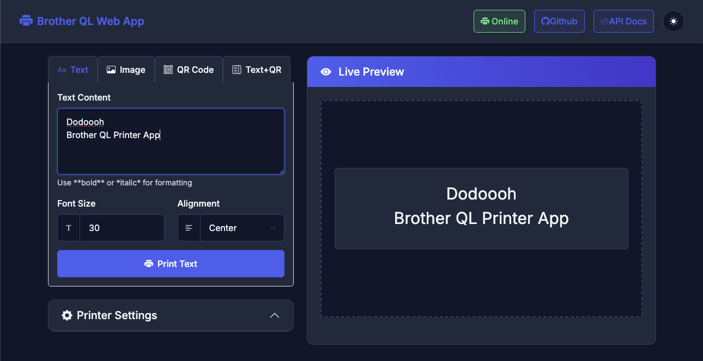
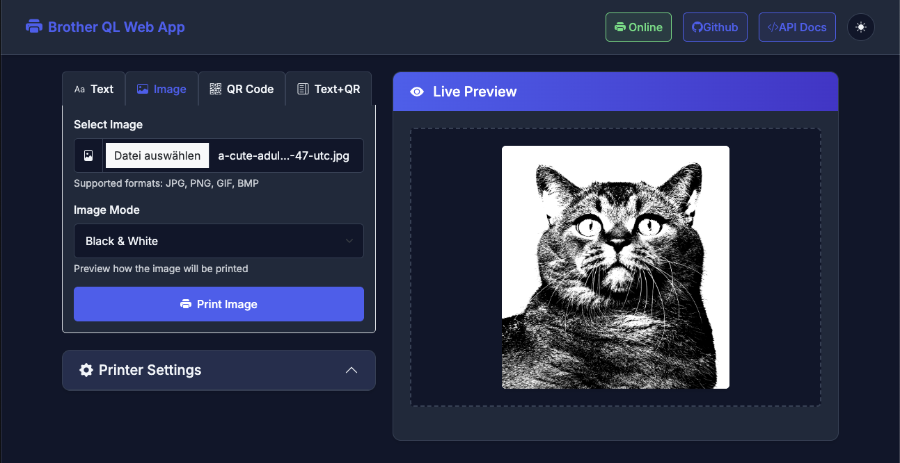
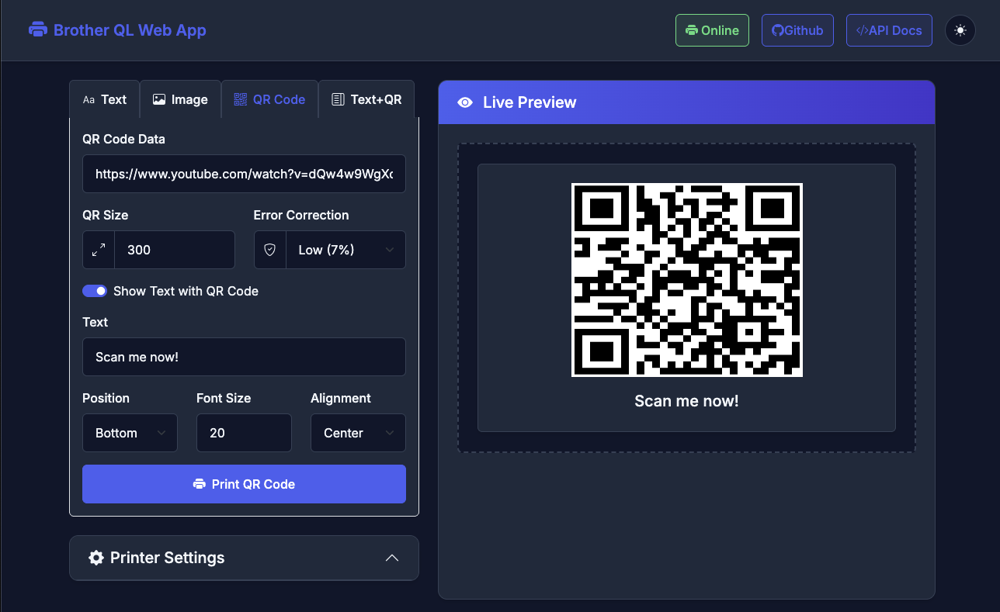
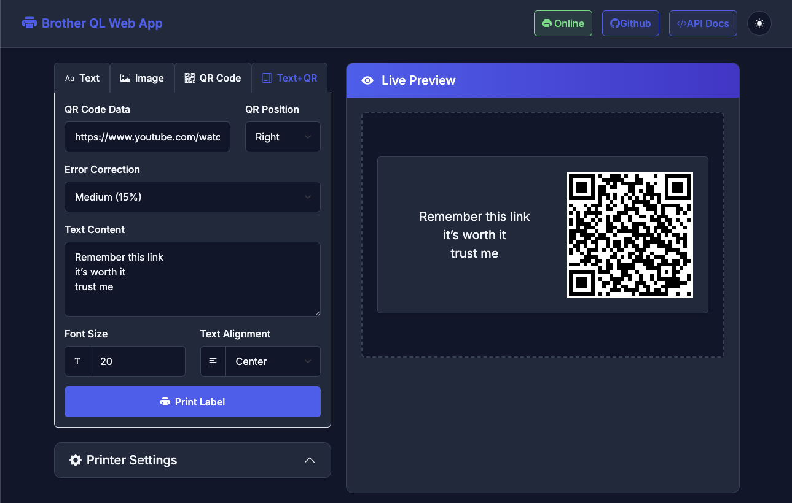

# Brother QL Printer App

[](https://hub.docker.com/r/dodoooh/brother_ql_app)
[](https://github.com/dodoooh/brother_ql_app/releases)
[](https://github.com/dodoooh/brother_ql_app/issues)
[](https://github.com/dodoooh/brother_ql_app/blob/main/changelog.md)

A modern web application to control Brother QL printers, enabling customizable text, image, and QR code printing with ease.

## 🚀 Features

- **🖋 Text Printing**: Easily print HTML-formatted text, such as `<b>Bold</b>` or `<span color="red">Red</span>`, for precise label designs.

- **🖼 Image Printing**: Upload and print images effortlessly to create visually appealing labels.

- **📱 QR Code Generation**: Create and print QR codes for URLs, contact information, or any text data.

- **🔀 Combined Layouts**: Print text and QR codes together with customizable positioning.
- **👁️ Live Preview**: See how your labels will look before printing for all label types.

- **⚙️ Custom Settings**: Fine-tune font size, label size, and text alignment to match your specific needs.

- **🔗 API Support**: Seamlessly integrate with external systems like Home Assistant ❤️ via a comprehensive, documented API.

- **🖨 Multiple Printer Support**: Control multiple printers simultaneously via the API, enabling the use of different label sizes and configurations for various tasks.

- **🔄 Printer Keep Alive**: Prevent your printer from shutting down with the keep alive feature.

- **📱 Responsive Design**: Enjoy a smooth user experience on desktop, tablet, and smartphone devices.

- **🌙 Dark Mode**: Modern interface with automatic dark mode support based on system preferences.

- **📚 Swagger Documentation**: Explore and test the API using the built-in Swagger UI documentation.

- **🔄 Error Handling**: Robust error handling with informative messages and toast notifications.

## 📸 Screenshots

### Text Printing


### Image Printing



### QR Code


### Text and QR Code



## 🏗️ Architecture

The application follows a modern, API-first approach with clear separation of concerns:

- **Frontend**: Responsive web interface built with HTML5, CSS3, and JavaScript with Bootstrap 5 and Bootstrap Icons
- **Backend**: Python Flask application with Connexion for OpenAPI/Swagger integration
- **API**: RESTful API with comprehensive documentation and structured error responses
- **Services**: Modular services for printer communication, settings management, QR code generation, etc.

## 🐳 Installation with Docker

### Docker Image

The application is available as a Docker image from DockerHub:

```bash
# DockerHub
docker pull dodoooh/brother_ql_app:latest  # or specific version: dodoooh/brother_ql_app:v3.0.0
```

### Using Docker Compose

Create a `docker-compose.yml` file:

```yaml
version: '3.8'

services:
  brother_ql_app:
    image: dodoooh/brother_ql_app:latest
    container_name: brother_ql_app
    ports:
      - "5000:5000"
    volumes:
      - ./data:/app/data
      - ./uploads:/app/uploads
    restart: unless-stopped
```

Start the service:

```bash
docker-compose up -d
```

### Using Docker Run

Run the application with:

```bash
docker run -d \
  -p 5000:5000 \
  --name brother_ql_app \
  -v ./data:/app/data \
  -v ./uploads:/app/uploads \
  dodoooh/brother_ql_app:latest
```

### Access the Application

Open your browser and navigate to [http://localhost:5000](http://localhost:5000)

## 🛠️ Development Setup

### Prerequisites

- Python 3.8+
- pip
- Git

### Installation

1. Clone the repository:
   ```bash
   git clone https://github.com/dodoooh/brother_ql_app.git
   cd brother_ql_app
   ```

2. Run the setup script:
   ```bash
   ./run_app.sh
   ```
   
   This script will:
   - Create a virtual environment
   - Install dependencies
   - Start the application

3. Access the application at [http://localhost:5000](http://localhost:5000)

## Configuration

The application settings can be configured in the `data/settings.json` file. This file contains various options for printer settings, including:

- `printer_uri`: The URI of the printer to use (e.g., `tcp://192.168.1.100` when over network, or `file:///dev/usb/lp0` when using USB)
- `printer_model`: The model of the printer (e.g., `QL-800`)
- `label_size`: The size of the label to print (e.g., `62`)
- `keep_alive_enabled`: Whether to keep the printer connection alive (only needed for network printers)
- `keep_alive_interval`: The interval for keep-alive messages (in seconds)

## 📔 API Documentation

The API is fully documented using OpenAPI/Swagger. You can access the interactive documentation at [http://localhost:5000/api/v1/ui/](http://localhost:5000/api/v1/ui/) when the application is running.

### Available Endpoints

- **GET /api/v1/settings**: Get current settings
- **PUT /api/v1/settings**: Update settings
- **GET /api/v1/printers**: Get available printers
- **POST /api/v1/printers/status**: Check printer status
- **POST /api/v1/text/print**: Print text on a label
- **POST /api/v1/image/print**: Print image on a label
- **POST /api/v1/qrcode/print**: Print QR code on a label
- **POST /api/v1/label/text-qrcode**: Print combined text and QR code on a label
- **POST /api/v1/printers/keep-alive**: Control the printer keep alive feature

## 📤 Example API Usage

### **Text Printing**

Use the `/api/v1/text/print` endpoint to print formatted text.

```python
import requests

url = 'http://localhost:5000/api/v1/text/print'
payload = {
    "text": {
        "content": "Hello World!\nThis is a test print.",
        "font_size": 40,
        "alignment": "center"
    },
    "settings": {
        "printer_uri": "tcp://192.168.1.100",
        "printer_model": "QL-800",
        "label_size": "62",
        "rotate": 90,
        "threshold": 70.0,
        "dither": True,
        "compress": True,
        "red": False
    }
}

response = requests.post(url, json=payload)

if response.status_code == 200:
    print("Success:", response.json())
else:
    print("Error:", response.status_code, response.json())
```

### **Image Printing**

Use the `/api/v1/image/print` endpoint to upload and print an image.

```python
import requests
import json

url = 'http://localhost:5000/api/v1/image/print'
image_path = '/path/to/image.jpg'  # Replace with the path to your image
settings = {
    "settings": {
        "printer_uri": "tcp://192.168.1.100",
        "printer_model": "QL-800",
        "label_size": "62",
        "rotate": 180,
        "threshold": 70.0,
        "dither": False,
        "compress": False,
        "red": True
    }
}

with open(image_path, 'rb') as img_file:
    files = {
        'image': img_file
    }
    data = {
        'settings': json.dumps(settings["settings"])
    }
    response = requests.post(url, files=files, data=data)

if response.status_code == 200:
    print("Success:", response.json())
else:
    print("Error:", response.status_code, response.json())
```

### **QR Code Printing**

Use the `/api/v1/qrcode/print` endpoint to generate and print a QR code.

```python
import requests

url = 'http://localhost:5000/api/v1/qrcode/print'
payload = {
    "qr": {
        "data": "https://github.com/dodoooh/brother_ql_app",
        "box_size": 10,
        "border": 4,
        "error_correction": "M",
        "version": 1,
        "size": 400
    },
    "settings": {
        "printer_uri": "tcp://192.168.1.100",
        "printer_model": "QL-800",
        "label_size": "62",
        "rotate": 0,
        "threshold": 70.0,
        "dither": False,
        "compress": False,
        "red": False
    }
}

response = requests.post(url, json=payload)

if response.status_code == 200:
    print("Success:", response.json())
else:
    print("Error:", response.status_code, response.json())
```

### **Combined Text and QR Code**

Use the `/api/v1/label/text-qrcode` endpoint to print text and QR code together.

```python
import requests

url = 'http://localhost:5000/api/v1/label/text-qrcode'
payload = {
    "text": {
        "content": "Product: Widget XYZ\nSKU: 12345\nPrice: $19.99",
        "font_size": 30,
        "alignment": "left"
    },
    "qr": {
        "data": "https://github.com/dodoooh/brother_ql_app",
        "box_size": 10,
        "border": 4,
        "error_correction": "M",
        "position": "right",
        "size": 400,
        "version": 1
    },
    "settings": {
        "printer_uri": "tcp://192.168.1.100",
        "printer_model": "QL-800",
        "label_size": "62",
        "rotate": 0,
        "threshold": 70.0,
        "dither": False,
        "compress": False,
        "red": False
    }
}

response = requests.post(url, json=payload)

if response.status_code == 200:
    print("Success:", response.json())
else:
    print("Error:", response.status_code, response.json())
```

### **Printer Keep Alive**

Use the `/api/v1/printers/keep-alive` endpoint to control the printer keep alive feature.

```python
import requests

url = 'http://localhost:5000/api/v1/printers/keep-alive'

# Enable keep alive feature
payload = {
    "settings": {
        "printer_uri": "tcp://192.168.1.100",
        "printer_model": "QL-800"
    },
    "keep_alive": {
        "enabled": True,
        "interval": 300  # Interval in seconds (5 minutes)
    }
}

response = requests.post(url, json=payload)

if response.status_code == 200:
    print("Success:", response.json())
else:
    print("Error:", response.status_code, response.json())

# Disable keep alive feature
payload = {
    "settings": {
        "printer_uri": "tcp://192.168.1.100",
        "printer_model": "QL-800"
    },
    "keep_alive": {
        "enabled": False
    }
}

response = requests.post(url, json=payload)

if response.status_code == 200:
    print("Success:", response.json())
else:
    print("Error:", response.status_code, response.json())
```

## 📝 License

This project is licensed under the [Creative Commons Attribution-NonCommercial-ShareAlike 4.0 International Public License](LICENSE).

## 🤝 Contributing

Contributions are welcome! Please open an issue or submit a pull request.

## 📄 Changelog

See [CHANGELOG.md](changelog.md) for more information.

---

**Enjoy using the Brother QL Printer App! If you encounter any issues or have suggestions for improvements, feel free to reach out through our [GitHub Issues](https://github.com/dodoooh/brother_ql_app/issues).**
